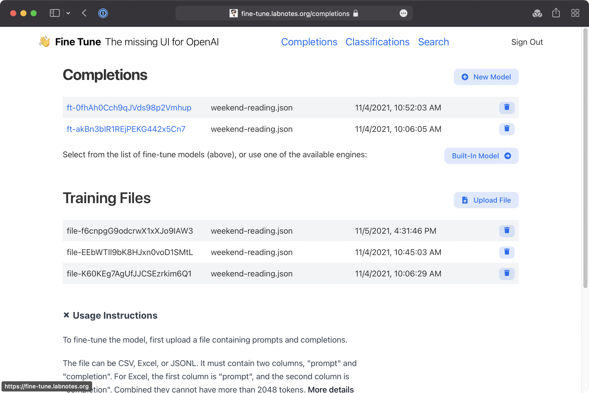

## 🏆 OpenAI Fine Tuner: Train your openAI Model



* Go beyond the playground
* **Fine tune** your completion model by uploading training and validation files
* Upload **classification** and **search** files
* CSV, Excel spreadsheets, and of course JSONL
* Play around and see the API requests

Co-authored-by: shinydev1992 <shinydev1108@gmail.com>
Co-authored-by: popstar0126 <popstar0126@gmail.com>
Co-authored-by: enjoymylif <noru0916@gmail.com>
Co-authored-by: kingstar0126 <popstar0126@gmai.com>


## Run It Yourself

```bash
yarn install
yarn dev
open http://localhost:3000
```
